Here's a mermaid chart representing the command reference you provided:

```mermaid
graph TD
    A[📋 Complete Command Reference] --> B[🚀 1. Initial Environment Setup]
    B --> B1[Start Minikube with sufficient resources]
    B --> B2[Verify Minikube status]
    B --> B3[Create monitoring namespace]
    B --> B4[Set and verify context]

    A --> C[📦 2. Grafana Installation with Image Renderer]
    C --> C1[Install via Helm]
    C1 --> C1a[Add and update Bitnami repo]
    C1 --> C1b[Get and customize values file]
    C1 --> C1c[Add image renderer to values.yaml]
    C1 --> C1d[Install Grafana]
    C --> C2[Verify Installation]
    C2 --> C2a[Check pod status]
    C2 --> C2b[Check events if pods are failing]
    C2 --> C2c[Get admin password]

    A --> D[🔄 3. Port Forwarding and Access]
    D --> D1[Local Development]
    D1 --> D1a[Forward Grafana UI]
    D1 --> D1b[Forward JSON data source]
    D1 --> D1c[Verify the pod is running]
    D1 --> D1d[Check the logs]
    D1 --> D1e[Test the endpoint]
    D --> D2[Codespaces Environment]

    A --> E[📸 4. Screenshot API Usage]
    E --> E1[Set the API Key]
    E1 --> E1a[Generate API key from Grafana UI]
    E1 --> E1b[Test API key access]
    E --> E2[Render Dashboard with Time Range]

    A --> F[🔧 5. Troubleshooting Commands]
    F --> F1[Pod Issues]
    F1 --> F1a[Check pod logs]
    F1 --> F1b[Check pod events]
    F1 --> F1c[Restart deployment]
    F --> F2[Plugin Issues]

    A --> G[🧹 6. Cleanup]
    G --> G1[Remove Grafana installation]
    G --> G2[Delete namespace and all resources]
    G --> G3[Stop Minikube if needed]

    A --> H[💡 Common Issues & Solutions]
    H --> H1[Secret not found]
    H --> H2[Port forwarding issues]
    H --> H3[Image renderer fails]
    H --> H4[API errors]

    A --> I[⚠️ Prerequisites]
    I --> I1[Minikube or K8s cluster running]
    I --> I2[Helm 3.x installed]
    I --> I3[kubectl configured]
    I --> I4[Sufficient cluster resources]

    A --> J[🎯 Objective]
    J --> J1[Create a comprehensive list of all commands]
    J --> J2[Ensure commands are properly categorized]
    J --> J3[Include relevant context and prerequisites]

    A --> K[📋 Requirements]
    K --> K1[Scan all project files for commands and scripts]
    K --> K2[Include the image-renderer image and the port forwarding code]
    K --> K3[Organize commands by workflow stage/purpose]
    K --> K4[Add descriptions and usage notes]
    K --> K5[Validate command syntax]
    K --> K6[Include error handling guidance]

    A --> L[🔄 Actions]
    L --> L1[Review all project files systematically]
    L --> L2[Extract and document commands]
    L --> L3[Group related commands together]
    L --> L4[Add proper formatting and structure]
    L --> L5[Test command sequences]
    L --> L6[Update documentation with findings]

    A --> M[📝 Format Guidelines]
    M --> M1[Use clear section headers]
    M --> M2[Include command descriptions]
    M --> M3[Add usage examples]
    M --> M4[Note prerequisites]
    M --> M5[Document expected outputs]
    M --> M6[Highlight important warnings]

    A --> N[🏷️ Categories to Include]
    N --> N1[Setup/Installation]
    N --> N2[Configuration]
    N --> N3[Operation/Usage]
    N --> N4[Maintenance]
    N --> N5[Troubleshooting]
    N --> N6[Cleanup]
```

This chart outlines the structure and flow of the command reference. If you need any adjustments or further details, feel free to let me know! 😊