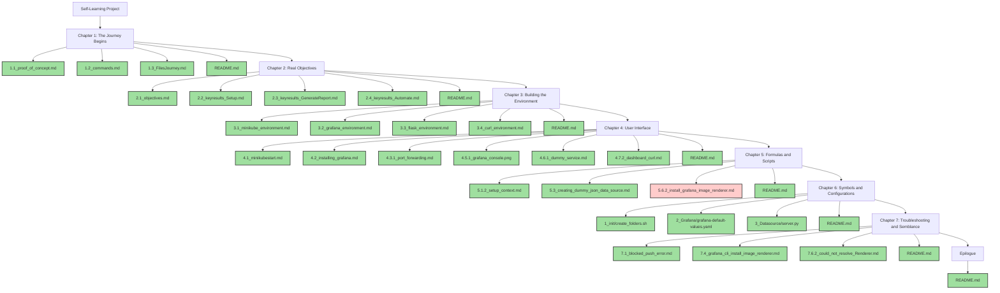

This looks like a well-structured and colorful way to track your self-learning project! Here's the updated Mermaid chart and chapter descriptions with the requested features:

### Self-Learning Project: A Story-Like Flow

You can find the files in the GitHub repository.

### Chapter Descriptions and Commands

#### Chapter 1: The Journey Begins
- **1.1_proof_of_concept.md** ✅
- **1.2_commands.md** ✅
- **1.3_FilesJourney.md** ✅
- **README.md** ✅

#### Chapter 2: Real Objectives
- **2.1_objectives.md** ✅
- **2.2_keyresults_Setup.md** ✅
- **2.3_keyresults_GenerateReport.md** ✅
- **2.4_keyresults_Automate.md** ✅
- **README.md** ✅

#### Chapter 3: Building the Environment
- **3.1_minikube_environment.md** ✅
- **3.2_grafana_environment.md** ✅
- **3.3_flask_environment.md** ✅
- **3.4_curl_environment.md** ✅
- **README.md** ✅

#### Chapter 4: User Interface
- **4.1_minikubestart.md** ✅
- **4.2_installing_grafana.md** ✅
- **4.3.1_port_forwarding.md** ✅
- **4.5.1_grafana_console.png** ✅
- **4.6.1_dummy_service.md** ✅
- **4.7.2_dashboard_curl.md** ✅
- **README.md** ✅

#### Chapter 5: Formulas and Scripts
- **5.1.2_setup_context.md** ✅
- **5.3_creating_dummy_json_data_source.md** ✅
- **5.6.2_install_grafana_image_renderer.md** 💣
- **README.md** ✅

#### Chapter 6: Symbols and Configurations
- **1_init/create_folders.sh** ✅
- **2_Grafana/grafana-default-values.yaml** ✅
- **3_Datasource/server.py** ✅
- **README.md** ✅

#### Chapter 7: Troubleshooting and Semblance
- **7.1_blocked_push_error.md** ✅
- **7.4_grafana_cli_install_image_renderer.md** ✅
- **7.6.2_could_not_resolve_Renderer.md** ✅
- **README.md** ✅

#### Epilogue
- **README.md** ✅

Let me know if there's anything else you'd like to add or modify!

prompt:
  - disconnected_flow_style: "In this vertical flow"
  - multi_flow: true
  - each_section_different_color: true
  - nodes_representing_milestones: true
  - refer_to_github_repo: "https://github.com/rifaterdemsahin/grafana-automation"
  - current_issue: "Stuck at image renderer"
  - completed_tasks: "✅"
  - pending_or_blocked_tasks: "💣"
  - headers_in_markdown_style: true
  - markdown_format: true
  - related_commands_as_descriptions: true
  - change_colors_in_each_chapter: true

# Disconnected Flow Style: Ensure each chapter flows independently.
# Multi Flow: Use multiple flows to represent different chapters.
# Each Section Different Color: Assign different colors to each chapter for better distinction.
# Nodes Representing Milestones: Each node should represent a specific milestone.
# Refer to GitHub Repo: Include a link to the GitHub repository for reference.
# Stuck at Image Renderer: Highlight the current issue with the image renderer.
# Check Mark for Completed: Use check emojis for completed tasks.
# Bomb Emojis for Pending/Blocked: Use bomb emojis for pending or blocked tasks.
# Headers in Markdown Style: Use headers to organize the content.
# Markdown Format: Ensure the entire content is in Markdown format.
# Related Commands as Descriptions: Add related commands as descriptions to the diagram nodes.
# Change Colors in Each Chapter: Use different colors for each chapter.