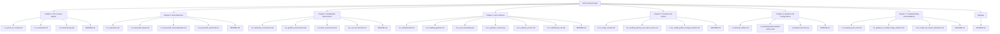

Sure, here's the Mermaid chart for vertical viewing:

```mermaid
graph TB
    A[Self-Learning Project] --> B[Chapter 1: The Journey Begins]
    B --> B1[1.1_proof_of_concept.md]
    B --> B2[1.2_commands.md]
    B --> B3[1.3_FilesJourney.md]
    B --> B4[README.md]

    A --> C[Chapter 2: Real Objectives]
    C --> C1[2.1_objectives.md]
    C --> C2[2.2_keyresults_Setup.md]
    C --> C3[2.3_keyresults_GenerateReport.md]
    C --> C4[2.4_keyresults_Automate.md]
    C --> C5[README.md]

    A --> D[Chapter 3: Building the Environment]
    D --> D1[3.1_minikube_environment.md]
    D --> D2[3.2_grafana_environment.md]
    D --> D3[3.3_flask_environment.md]
    D --> D4[3.4_curl_environment.md]
    D --> D5[README.md]

    A --> E[Chapter 4: User Interface]
    E --> E1[4.1_minikubestart.md]
    E --> E2[4.2_installing_grafana.md]
    E --> E3[4.3.1_port_forwarding.md]
    E --> E4[4.5.1_grafana_console.png]
    E --> E5[4.6.1_dummy_service.md]
    E --> E6[4.7.2_dashboard_curl.md]
    E --> E7[README.md]

    A --> F[Chapter 5: Formulas and Scripts]
    F --> F1[5.1.2_setup_context.md]
    F --> F2[5.3_creating_dummy_json_data_source.md]
    F --> F3[5.6.2_install_grafana_image_renderer.md]
    F --> F4[README.md]

    A --> G[Chapter 6: Symbols and Configurations]
    G --> G1[1_init/create_folders.sh]
    G --> G2[2_Grafana/grafana-default-values.yaml]
    G --> G3[3_Datasource/server.py]
    G --> G4[README.md]

    A --> H[Chapter 7: Troubleshooting and Semblance]
    H --> H1[7.1_blocked_push_error.md]
    H --> H2[7.4_grafana_cli_install_image_renderer.md]
    H --> H3[7.6.2_could_not_resolve_Renderer.md]
    H --> H4[README.md]

    A --> I[Epilogue]
    I --> I1[README.md]
```

This vertical layout should make it easier to view the structure of your project. Let me know if you need any further adjustments!