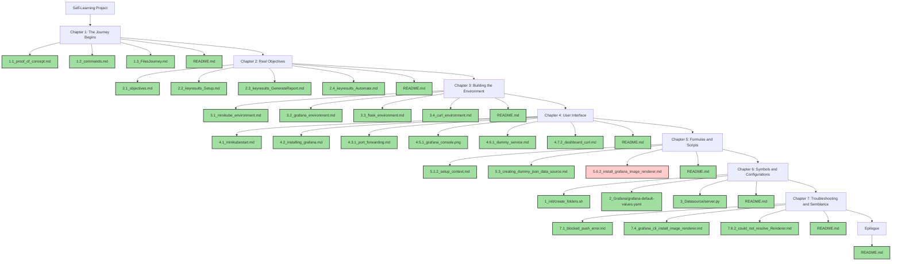

### Self-Learning Project: A Story-Like Flow

Here's a story-like flow for your self-learning project, with a vertical Mermaid chart and each section in a different color. Each node represents a specific milestone, and I've marked the completed parts with a check mark. We're currently stuck at the image renderer.

You can find the files in the GitHub repository.

### Chapter Descriptions and Commands

#### Chapter 1: The Journey Begins
- **1.1_proof_of_concept.md** ✅
- **1.2_commands.md** ✅
- **1.3_FilesJourney.md** ✅
- **README.md** ✅

#### Chapter 2: Real Objectives
- **2.1_objectives.md** ✅
- **2.2_keyresults_Setup.md** ✅
- **2.3_keyresults_GenerateReport.md** ✅
- **2.4_keyresults_Automate.md** ✅
- **README.md** ✅

#### Chapter 3: Building the Environment
- **3.1_minikube_environment.md** ✅
- **3.2_grafana_environment.md** ✅
- **3.3_flask_environment.md** ✅
- **3.4_curl_environment.md** ✅
- **README.md** ✅

#### Chapter 4: User Interface
- **4.1_minikubestart.md** ✅
- **4.2_installing_grafana.md** ✅
- **4.3.1_port_forwarding.md** ✅
- **4.5.1_grafana_console.png** ✅
- **4.6.1_dummy_service.md** ✅
- **4.7.2_dashboard_curl.md** ✅
- **README.md** ✅

#### Chapter 5: Formulas and Scripts
- **5.1.2_setup_context.md** ✅
- **5.3_creating_dummy_json_data_source.md** ✅
- **5.6.2_install_grafana_image_renderer.md** 💣
- **README.md** ✅

#### Chapter 6: Symbols and Configurations
- **1_init/create_folders.sh** ✅
- **2_Grafana/grafana-default-values.yaml** ✅
- **3_Datasource/server.py** ✅
- **README.md** ✅

#### Chapter 7: Troubleshooting and Semblance
- **7.1_blocked_push_error.md** ✅
- **7.4_grafana_cli_install_image_renderer.md** ✅
- **7.6.2_could_not_resolve_Renderer.md** ✅
- **README.md** ✅

#### Epilogue
- **README.md** ✅

Let me know if there's anything else you'd like to add or modify!
prompt:
- disconnected flow style In this vertical flow
- multi flow
- each section different color
- With each node representing a specific milestone
- Refer to files in this github repo https://github.com/rifaterdemsahin/grafana-automation
- Mention we are stuck at image renderer mark other parts with check mark complete
- add headers in markdown style
- Have a markdown format
- add related commands as desription to to the diagram nodes
- change colors in each chapter
- use check emojis for completed
- use bomb emojis for pending or blocked
