Here's a story-like flow for your self-learning project, with a vertical Mermaid chart and each section in a different color. Each node represents a specific milestone, and I've marked the completed parts with a check mark. We're currently stuck at the image renderer.

```mermaid
graph TD
    A[Self-Learning Project]
    A --> B[Chapter 1: The Journey Begins]
    B --> B1[1.1_proof_of_concept.md]:::completed
    B --> B2[1.2_commands.md]:::completed
    B --> B3[1.3_FilesJourney.md]:::completed
    B --> B4[README.md]:::completed

    A --> C[Chapter 2: Real Objectives]
    C --> C1[2.1_objectives.md]:::completed
    C --> C2[2.2_keyresults_Setup.md]:::completed
    C --> C3[2.3_keyresults_GenerateReport.md]:::completed
    C --> C4[2.4_keyresults_Automate.md]:::completed
    C --> C5[README.md]:::completed

    A --> D[Chapter 3: Building the Environment]
    D --> D1[3.1_minikube_environment.md]:::completed
    D --> D2[3.2_grafana_environment.md]:::completed
    D --> D3[3.3_flask_environment.md]:::completed
    D --> D4[3.4_curl_environment.md]:::completed
    D --> D5[README.md]:::completed

    A --> E[Chapter 4: User Interface]
    E --> E1[4.1_minikubestart.md]:::completed
    E --> E2[4.2_installing_grafana.md]:::completed
    E --> E3[4.3.1_port_forwarding.md]:::completed
    E --> E4[4.5.1_grafana_console.png]:::completed
    E --> E5[4.6.1_dummy_service.md]:::completed
    E --> E6[4.7.2_dashboard_curl.md]:::completed
    E --> E7[README.md]:::completed

    A --> F[Chapter 5: Formulas and Scripts]
    F --> F1[5.1.2_setup_context.md]:::completed
    F --> F2[5.3_creating_dummy_json_data_source.md]:::completed
    F --> F3[5.6.2_install_grafana_image_renderer.md]:::stuck
    F --> F4[README.md]:::completed

    A --> G[Chapter 6: Symbols and Configurations]
    G --> G1[1_init/create_folders.sh]:::completed
    G --> G2[2_Grafana/grafana-default-values.yaml]:::completed
    G --> G3[3_Datasource/server.py]:::completed
    G --> G4[README.md]:::completed

    A --> H[Chapter 7: Troubleshooting and Semblance]
    H --> H1[7.1_blocked_push_error.md]:::completed
    H --> H2[7.4_grafana_cli_install_image_renderer.md]:::completed
    H --> H3[7.6.2_could_not_resolve_Renderer.md]:::completed
    H --> H4[README.md]:::completed

    A --> I[Epilogue]
    I --> I1[README.md]:::completed

    classDef completed fill:#9fdf9f,stroke:#333,stroke-width:2px;
    classDef stuck fill:#ffcccb,stroke:#333,stroke-width:2px;
```

You can find the files in the GitHub repository. Let me know if there's anything else you'd like to add or modify!

prompt:
- disconnected flow style In this vertical flow
- multi flow
- each section different color
- With each node representing a specific milestone
- Refer to files in this github repo https://github.com/rifaterdemsahin/grafana-automation
- Mention we are stuck at image renderer mark other parts with check mark complete
- add headers in markdown style
- Have a markdown format